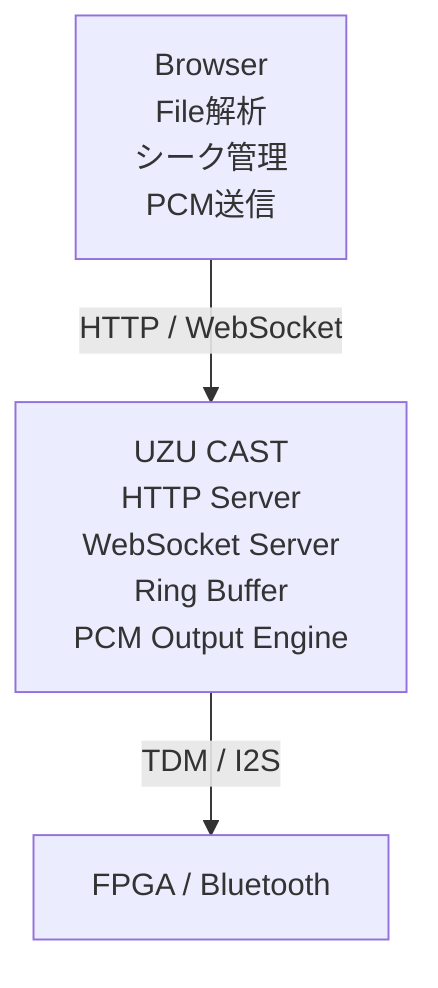
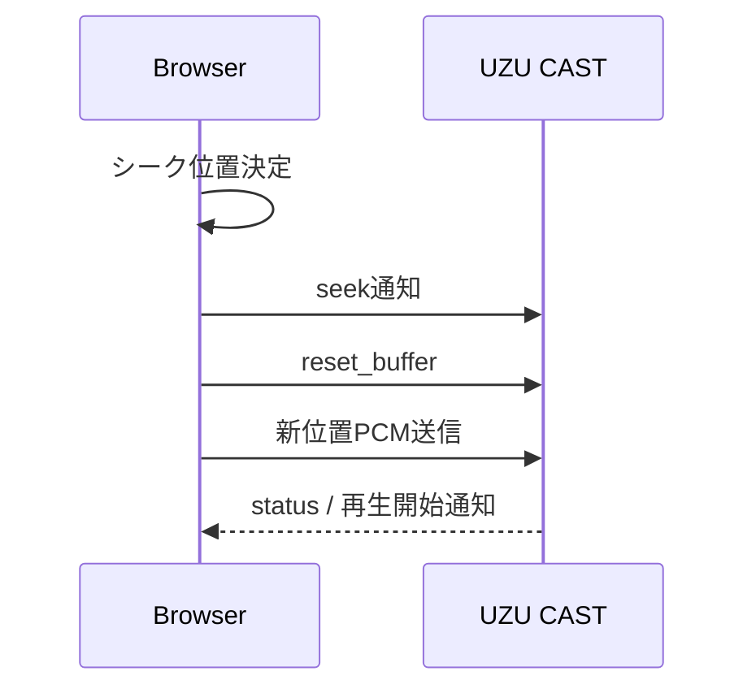
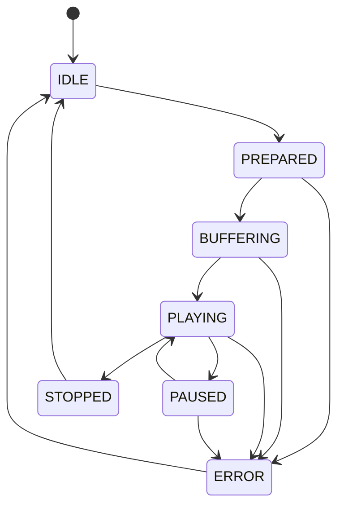

# UZU CAST V3 通信仕様書

Revision : R0  
Date : 2026-05-22  

---

## 1. 概要

UZU CAST V3では、従来のSDカード再生機能に加え、ブラウザからリアルタイムにPCM音声データを転送する「ストリームモード」を追加する。

本仕様では、以下を定義する。

- 動作モード
- WebSocket通信仕様
- PCMストリーム転送仕様
- バッファ制御仕様
- 状態遷移
- コマンド仕様

---

## 2. V3追加・変更点

| 区分     | 内容                            |
| ------ | ----------------------------- |
| 【V3追加】 | ストリームモード追加                    |
| 【V3追加】 | WebSocket Binary による PCM 転送   |
| 【V3追加】 | ブラウザ側でファイル解析・シーク管理            |
| 【V3追加】 | UZU CAST側リングバッファ管理            |
| 【V3追加】 | バッファ空き容量通知                    |
| 【V3変更】 | UZU CASTをPCM受信エンジンとして動作可能に変更  |
| 【V3変更】 | ストリームモード時、コマンドプロンプトは状態表示中心へ変更 |

---

## 3. システム構成



---

## 4. 動作モード

### 4.1 SDカードモード

従来モード。

#### 機能

- SDカードファイル再生
- 再生
- 停止
- 一時停止
- シーク
- ファイル一覧取得
- ボリューム制御

#### コマンドプロンプト

全操作可能。

---

### 4.2 ストリームモード 【V3追加】

ブラウザからPCMデータをリアルタイム受信するモード。

#### 特徴

- ブラウザが再生制御を行う
- UZU CASTはPCM出力を担当
- シークはブラウザ側で管理
- UZU CASTは受信バッファを管理

#### コマンドプロンプト

主に状態表示のみ。

#### 使用可能コマンド

- status
- buffer
- stop
- reset
- mode

---

## 5. 通信方式

| 用途     | 方式                   |
| ------ | -------------------- |
| 操作画面   | HTTP                 |
| 制御コマンド | WebSocket Text(JSON) |
| PCM転送  | WebSocket Binary     |
| 状態通知   | WebSocket Text(JSON) |

---

## 6. WebSocket通信仕様

### 6.1 Text Frame

JSON形式で送受信する。

#### 文字コード

UTF-8

---

### 6.2 Binary Frame

PCMデータを送信する。

#### 初期仕様

```text
[PCM DATA ONLY]
```

#### 備考

初期版ではBinaryヘッダを持たない。

必要時に以下追加を検討。

- Sequence番号
- Timestamp
- Packetサイズ
- CRC

---

## 7. WebSocketコマンド仕様

### 7.1 Browser → UZU CAST

---

#### set_mode

動作モード変更。

```json
{
  "cmd": "set_mode",
  "mode": "STREAM"
}
```

##### mode

| 値      | 内容       |
| ------ | -------- |
| SD     | SDカードモード |
| STREAM | ストリームモード |

---

#### file_info 【V3追加】

ファイル情報通知。

```json
{
  "cmd": "file_info",
  "name": "sample.wav",
  "size": 12345678,
  "sampleRate": 44100,
  "bitsPerSample": 16,
  "channels": 2,
  "durationMs": 180000
}
```

---

#### prepare 【V3追加】

ストリーム再生準備。

```json
{
  "cmd": "prepare"
}
```

---

#### start

再生開始。

```json
{
  "cmd": "start"
}
```

---

#### pause

一時停止。

```json
{
  "cmd": "pause"
}
```

---

#### resume

再開。

```json
{
  "cmd": "resume"
}
```

---

#### stop

停止。

```json
{
  "cmd": "stop"
}
```

---

#### seek 【V3追加】

シーク通知。

```json
{
  "cmd": "seek",
  "positionMs": 60000
}
```

##### 備考

実際のデータ位置管理はブラウザ側で行う。

---

#### reset_buffer 【V3追加】

受信バッファクリア。

```json
{
  "cmd": "reset_buffer"
}
```

---

#### ping

接続確認。

```json
{
  "cmd": "ping"
}
```

---

### 7.2 UZU CAST → Browser

---

#### status

状態通知。

```json
{
  "cmd": "status",
  "state": "PLAYING"
}
```

##### state

| 値         | 内容    |
| --------- | ----- |
| IDLE      | 待機    |
| PREPARED  | 準備完了  |
| BUFFERING | バッファ中 |
| PLAYING   | 再生中   |
| PAUSED    | 一時停止  |
| STOPPED   | 停止    |
| ERROR     | エラー   |

---

#### buffer_info 【V3追加】

バッファ状態通知。

```json
{
  "cmd": "buffer_info",
  "freeBytes": 32768,
  "usedBytes": 16384,
  "bufferSize": 49152
}
```

---

#### underrun 【V3追加】

バッファアンダーラン通知。

```json
{
  "cmd": "underrun"
}
```

---

#### error

エラー通知。

```json
{
  "cmd": "error",
  "message": "Invalid format"
}
```

---

#### pong

ping応答。

```json
{
  "cmd": "pong"
}
```

---

## 8. PCM転送仕様

### 8.1 データ形式

| 項目     | 内容               |
| ------ | ---------------- |
| データ形式  | PCM              |
| エンディアン | Little Endian    |
| 転送方式   | WebSocket Binary |

---

### 8.2 PCMデータ順序

```text
CH1-L
CH1-H
CH2-L
CH2-H
...
```

---

## 9. バッファ制御仕様 【V3追加】

### 9.1 バッファ方式

リングバッファ方式。

---

### 9.2 ブラウザ側送信制御

ブラウザは `freeBytes` を監視し、空き容量以内で送信する。

---

### 9.3 アンダーラン

PCM不足時：

- underrun通知送信
- 無音出力
- 停止
- 再同期

等を今後選択可能とする。

---

## 10. シーク処理仕様 【V3追加】

### 10.1 シーク手順



---

## 11. 状態遷移



---

## 12. 今後の拡張予定

| 項目            | 内容           |
| ------------- | ------------ |
| Packet Header | Sequence番号追加 |
| CRC           | BinaryデータCRC |
| Timestamp     | AV同期対応       |
| BLE設定         | BLEによる設定     |
| 自動再同期         | バッファ自動補正     |
| 圧縮対応          | 将来的なCodec対応  |

---

## 13. Revision History

| Revision | Date       | 内容   |
| -------- | ---------- | ---- |
| R0       | 2026-05-22 | 初版作成 |
