# UzuCast V3 ファームウェア仕様書

Master（ESP32-S3）と Slave（ESP32）のプログラム構成・データフロー・スレッド構成をまとめた文書です。

| 項目 | Master | Slave |
|------|--------|-------|
| プロジェクト | `platformio/uzuCastV3_Main` | `platformio/uzuCastV3_Sub` |
| ボード | ESP32-S3 Dev Module | ESP32 Dev Module |
| ビルド番号 | `FIRMWARE_BUILD` **10046** | `BUILD_NUMBER` **96** |
| バージョン文字列 | `UZU CAST Version 1.00` | `UZU CAST Sub MP3 1.03 I2S-441-R-TAG` |
| Arduino 実行コア | Core 1 | Core 1 |

---

## 1. システム全体像

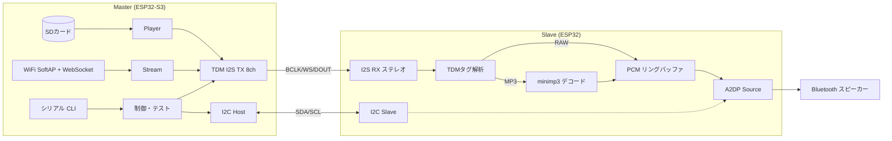

### 1.1 音声データの2系統

| 系統 | Master 出力形式 | Slave 受信・処理 | 用途 |
|------|----------------|-----------------|------|
| **RAW** | TDM CH1–7 = PCM、CH8 = `0xAAAA` | I2S L=PCM、R=`0xAAAA` として解釈しそのまま BT へ | `.UZU` 再生、WiFi ストリーム、SINTEST RAW |
| **MP3** | TDM CH1 = スロットワード、CH8 = `AA00`→`AA55`×N→`5500`→`0000` | スロットを組み立てて minimp3 デコード後 BT へ | `.uzc` 再生、SINTEST MP3 |

### 1.2 物理接続

| 信号 | Master GPIO | Slave GPIO | 備考 |
|------|-------------|------------|------|
| I2S BCLK | 5 | 32 | Master=TDM TX、Slave=RX Slave |
| I2S WS | 16 | 33 | |
| I2S データ | 4 (DOUT) | 35 (DIN) | 8ch TDM → Slave はステレオ I2S で受信 |
| I2C SDA | 41 | 21 | `UZU_ENABLE_I2C=1` 時のみ |
| I2C SCL | 40 | 22 | |

> **補足:** 現行ビルドでは Master/Slave ともに `UZU_ENABLE_I2C=0` がデフォルト。Slave はローカルボタンで BT 接続する構成。

---

## 2. Master ファームウェア

ソース: `platformio/uzuCastV3_Main/src/main.ino`（モノリシック、約 4800 行）

関連モジュール:

| ファイル | 役割 |
|----------|------|
| `main.ino` | 電源管理、SD、TDM、プレイヤー、ストリーム、Web UI、CLI |
| `uzc_tdm.cpp` | `.uzc` MP3 コンテナ読み出し・タグ付き TDM 送信 |
| `uzc_mp3_slot.h` | SINTEST MP3 用 441Hz 埋め込みスロット |
| `i2c_host.cpp` | I2C マスター（Slave モード同期・BT 仲裁） |
| `i2c_mode.cpp` | `TdmDataMode`（RAW / MP3）状態管理 |
| `i2c_protocol.h` | I2C アドレス・コマンド定義 |

### 2.1 起動シーケンス

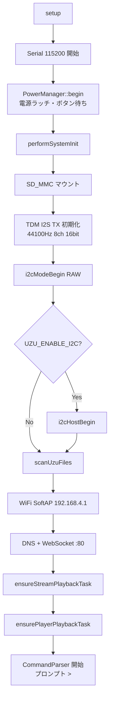

**電源管理 (`PowerManager`)**

- `POWER_PIN` で電源ラッチ保持
- 起動時 3 秒長押し待ち（`UZU_SKIP_POWER_BUTTON=1` でスキップ可）
- 動作中 3 秒長押しで `POWER_OFF` → `loop()` 内で無限待機

### 2.2 メインループ (`loop()`)

Arduino `loop` タスク（Core 1）で以下をポーリング実行します。音声の実出力は別タスクが担当します。

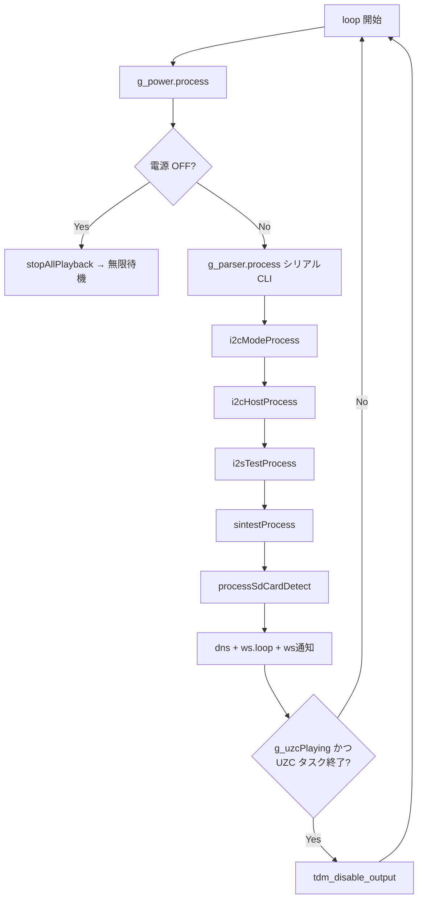

### 2.3 FreeRTOS タスク（Master）

| タスク名 | エントリ関数 | スタック | コア | 優先度 | 起動条件 | 処理内容 |
|----------|-------------|--------|------|--------|----------|----------|
| **Arduino loop** | `loop()` | (framework) | 1 | default | 常時 | CLI、I2C、I2STEST、SINTEST、WebSocket、SD 検出 |
| **streamAudio** | `streamPlaybackTask` | 4096 | 1 | 5 | `ensureStreamPlaybackTask()` | `g_deviceMode==STREAM` 時に `g_streamEngine.process()` |
| **playerAudio** | `playerPlaybackTask` | 4096 | 1 | 5 | `ensurePlayerPlaybackTask()` | SD の `.UZU` PCM 再生（`g_player.process()`） |
| **uzcTdm** | `UzcTdmPlayer::playbackTask` | 16384 | 1 | 5 | `.uzc` 再生開始時 | `.uzc` 読み出し・MP3 タグ TDM 送信、終了後自己削除 |

**playerAudio の動作ゲート**

以下のいずれかが真のときは `g_player.process()` を呼ばず 5ms スリープ:

- `g_deviceMode == STREAM`
- `g_uzcPlaying`
- `g_i2sTestActive`
- `g_sintestActive`

### 2.4 デバイスモード

#### 2.4.1 `DeviceMode`（グローバル再生モード）

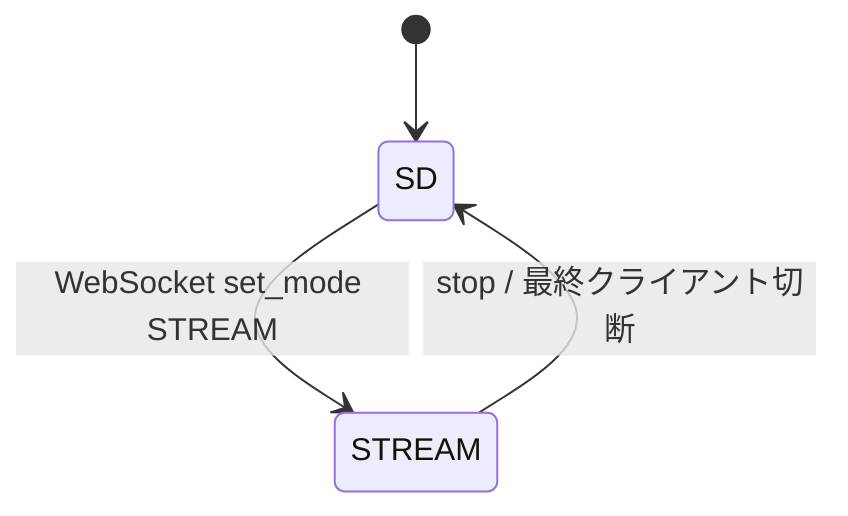

| モード | 定数 | 音声ソース | TDM 出力 |
|--------|------|-----------|----------|
| SD 再生 | `DeviceMode::SD` | SD 上の `.UZU` / `.uzc` | 各プレイヤー経由 |
| WiFi ストリーム | `DeviceMode::STREAM` | ブラウザ → WebSocket バイナリ | `StreamEngine` 経由 |

#### 2.4.2 SD 再生ルーティング

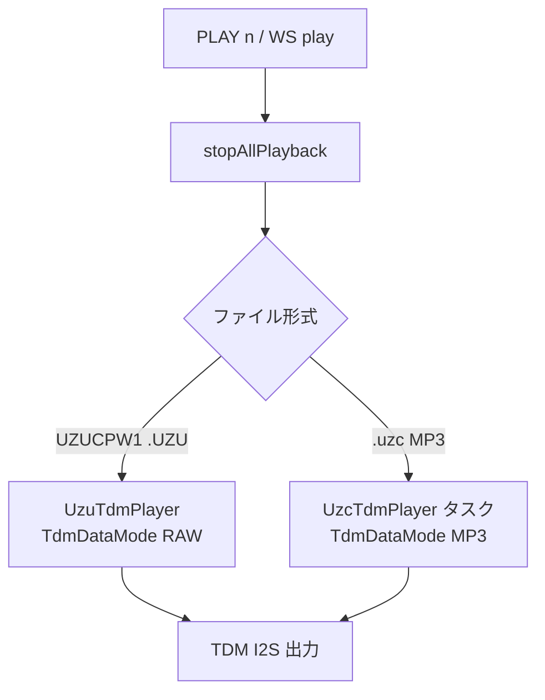

- 出力サンプルレートは常に **44100 Hz**（48 kHz ソースは Master 側でリサンプル）
- `TDM_NUM_CH=8`、`FRAMES_PER_WRITE=256` フレーム単位で `i2s_channel_write`

#### 2.4.3 WiFi ストリーム

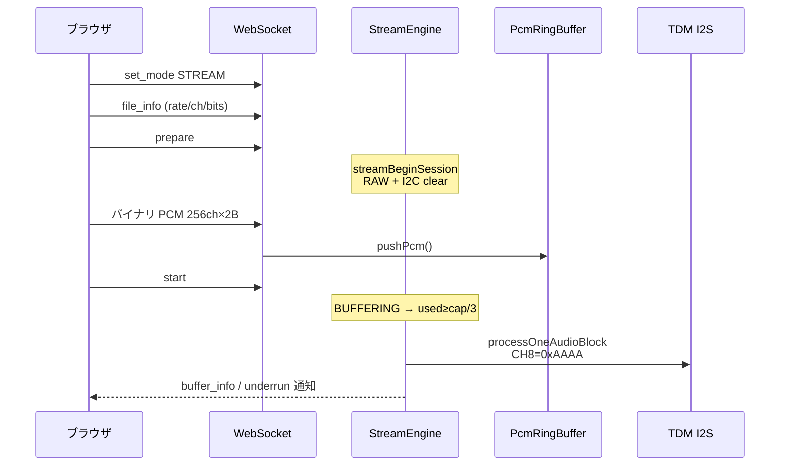

**`StreamState` 状態遷移**

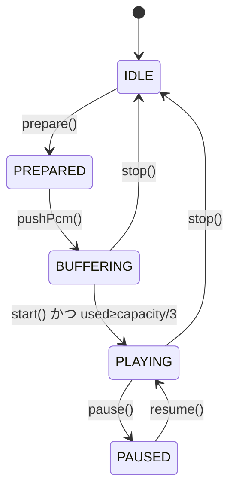

**リングバッファ (`PcmRingBuffer`)**

| 定数 | サイズ |
|------|--------|
| `PSRAM_TARGET_BYTES` | 1,048,576 バイト |
| `PSRAM_FALLBACK_BYTES` | 393,216 バイト |
| `INTERNAL_FALLBACK_BYTES` | 49,152 バイト |

#### 2.4.4 テストモード（SD/STREAM とは独立フラグ）

| モード | 起動 | 実行コンテキスト | 内容 |
|--------|------|-----------------|------|
| **I2STEST** | `I2STEST [sec]` | `loop()` | CH1 方形波 440Hz + CH8=`0xAAAA`、デフォルト 5 秒 |
| **SINTEST** | `TESTMODE` + `SINTEST` | `loop()` | Slave 検証用。RAW=440Hz サイン / MP3=441Hz スロット |

**SINTEST コマンド**

```
TESTMODE RAW|MP3
SINTEST 1|2|3|4|5|ALL|OFF
```

- RAW: 有効 CH にサイン波。CH1 ON 時は CH2・CH8 に `0xAAAA`
- MP3: `uzc_mp3_slot.h` の埋め込みスロットを TDM タグ列で送出
- I2C へも `RAW` / `MP3` をブロードキャスト

### 2.5 TDM I2S 出力仕様

| 定数 | 値 |
|------|-----|
| `TDM_NUM_CH` | 8 |
| CH1–CH7 (index 0–6) | オーディオデータ |
| CH8 (index 7) | 制御タグレーン |
| `I2S_TAG_RAW_TDM` | `0xAAAA` |
| `I2S_TAG_MP3_START` | `0xAA00` |
| `I2S_TAG_SLOT_DATA` | `0xAA55` |
| `I2S_TAG_MP3_END` | `0x5500` |
| `UZC_MP3_PERIOD_STEREO` | 1152 フレーム / 期間 |

**出力経路まとめ**

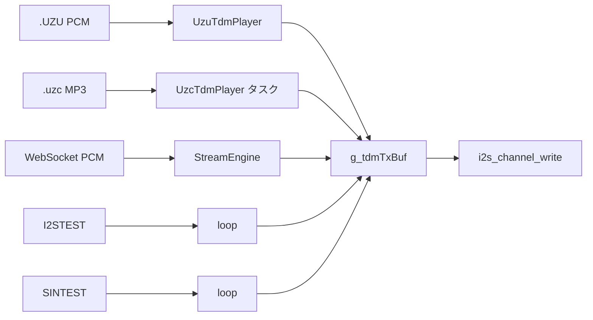

### 2.6 I2C Host（Master → Slave 制御）

`UZU_ENABLE_I2C=1` 時に有効。200ms 周期で `i2cHostProcess()` を実行。

| コマンド | ID | 用途 |
|----------|-----|------|
| `GET_STATUS` | 0x01 | Slave 状態取得 |
| `SET_MODE` | 0x02 | WAV_PCM(0x00) / MP3(0x01) |
| `GET_CONNECTED_TARGET` | 0x03 | 接続中 BT MAC |
| `GET_PENDING_TARGET` | 0x04 | 接続待ち BT MAC |
| `NOTIFY_CONNECT_PERMISSION` | 0x05 | BT 接続許可/拒否 |
| `CLEAR_BUFFER` | 0x07 | バッファクリア |
| `SET_DELAY` | 0x09 | 遅延 ms 設定 |

アドレス: `0x30` + チャンネル番号（CH1–CH5）

**BT 仲裁 (`processBtCoordination`)**

複数 Slave が同一 BT デバイスへ同時接続しようとした場合、Master が先着 MAC を許可し他を拒否します。

### 2.7 シリアル CLI（Master）

115200 8N1、プロンプト `>`。コマンドは大文字化して解析。

| カテゴリ | コマンド |
|----------|----------|
| システム | `HELP`, `RESET`, `STAT`, `CHECKDISK`, `MOUNT`, `FREQ` |
| ファイル | `DIR`, `FSTAT` |
| 再生 | `PLAY`, `PAUSE`, `STOP`, `SEEK`, `VOL` |
| モード | `MODE RAW\|MP3` |
| Slave テスト | `TESTMODE RAW\|MP3`, `SINTEST` |
| ベンチ | `I2STEST`, `I2STEST STOP`, `I2STEST DUMP` |
| I2C | `I2CSCAN`（I2C 有効時） |

### 2.8 `stopAllPlayback()` — 相互排他の中心

以下を一括停止します。モード切替・新規再生の前に必ず呼ばれます。

1. `i2sTestStop()`
2. `sintestStop()`
3. `g_uzcPlayer.stop()`
4. `g_player.stop()`
5. `g_streamEngine.stop()`

---

## 3. Slave ファームウェア

ソース: `platformio/uzuCastV3_Sub/src/main.ino`（モノリシック、約 3400 行）

関連モジュール:

| ファイル | 役割 |
|----------|------|
| `main.ino` | I2S RX、タグ解析、MP3 デコード、PCM バッファ、BT FSM |
| `minimp3.h` | MP3 デコード（minimp3） |
| `i2c_slave.cpp` | I2C スレーブ（オプション） |
| `i2c_protocol.h` | プロトコル定数 |

### 3.1 起動シーケンス

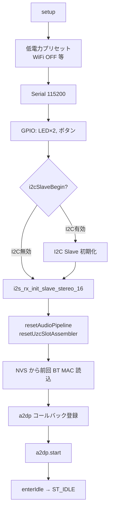

### 3.2 メインループ (`loop()`)

Slave は **専用 FreeRTOS タスクを作成せず**、Arduino `loop` タスク（Core 1）で全処理を協調的に実行します。末尾で `delay(1)`。

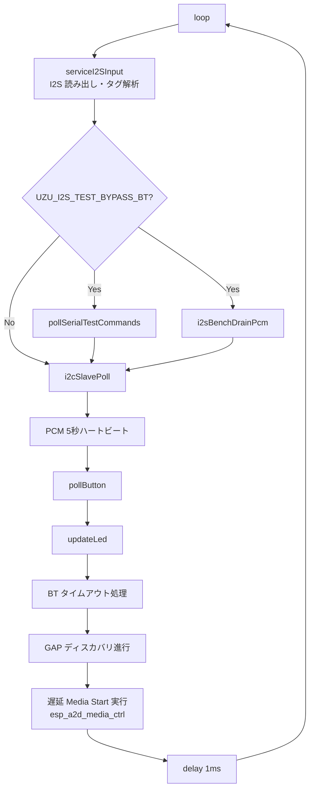

> **設計上の重要点:** `esp_a2d_media_ctrl(START)` は I2S/BT コールバック内では呼ばず、必ず `loop()` から実行します。

### 3.3 スレッド / 実行コンテキスト（Slave）

| コンテキスト | コア | 処理 |
|-------------|------|------|
| **Arduino loop** | 1 | I2S 入力、MP3 デコード（同期）、BT 状態機械、ボタン/LED |
| **ESP-IDF BT スタック** | 内部（通常 0） | GAP、A2DP 接続、SBC エンコード |
| **audio_cb** | BT/オーディオタスク | `g_pcm_hold` から A2DP フレーム供給 |

`uzcDecodeTask` / `g_uzc_decode_task` はスキャフォールドのみで、**実際の MP3 デコードは loop 内で同期実行**されます。

### 3.4 I2S 受信と TDM タグ解析

Slave は I2S **ステレオ** Slave RX（`I2S_NUM_1`）で Master の TDM を受けます。

- **L チャンネル** = データ（PCM サンプルまたは MP3 スロットワード）
- **R チャンネル** = タグ

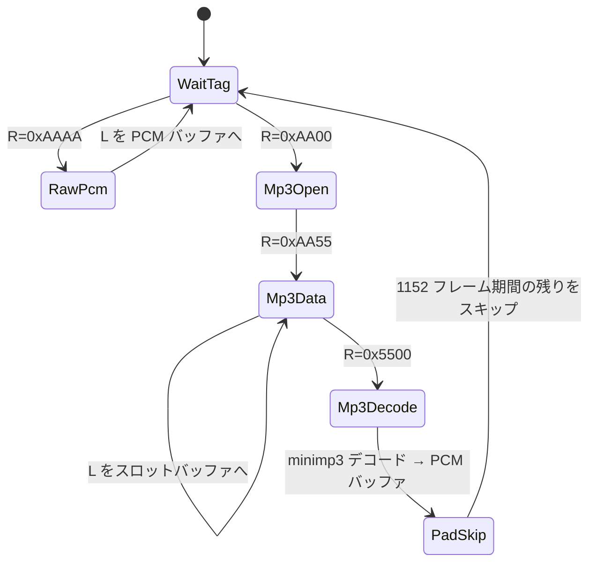

| タグ (R) | 値 | 動作 |
|----------|-----|------|
| `I2S_TAG_RAW` | `0xAAAA` | 44100Hz に設定、L をステレオ PCM として `pcmHoldAppend` |
| `I2S_TAG_MP3_START` | `0xAA00` | スロット組み立て開始 |
| `I2S_TAG_SLOT_DATA` | `0xAA55` | L のバイトをスロットバッファへ追加 |
| `I2S_TAG_MP3_END` | `0x5500` | スロット完成 → `decodeMp3SlotWorker` |
| `I2S_TAG_PAD` | `0xFFFF` | 無視 |

**I2S 処理ゲート (`uzcShouldProcessI2s`)**

| ビルド | 条件 |
|--------|------|
| `UZU_I2S_TEST_BYPASS_BT=1`（現行デフォルト） | 常に I2S 処理（BT 未接続でも可） |
| 通常ビルド | `ST_CONNECT` かつ `g_audio_enable` のときのみ |

### 3.5 MP3 デコードパス

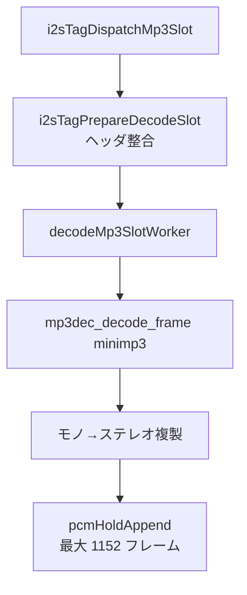

- スロット最大: `UZC_SLOT_BUF_MAX = 1024` バイト
- 1 期間: `UZC_MP3_PERIOD_STEREO_441 = 1152` ステレオフレーム

### 3.6 PCM バッファリング

| 定数 | フレーム数 | 時間 @ 44.1kHz | 役割 |
|------|-----------|----------------|------|
| `PCM_HOLD_FRAMES` | 5888 | 約 133 ms | リングバッファ総容量 |
| `PCM_PREBUFFER_FRAMES` | 3584 | 約 81 ms | BT Media Start 前の蓄積目標 |
| `PCM_PLAYBACK_MIN_HOLD` | 3072 | 約 70 ms | `audio_cb` 排出開始閾値 |
| `PCM_HOLD_PREPLAY_MAX` | 3968 | 約 90 ms | 再生前の上限（溢れ時ドロップ） |

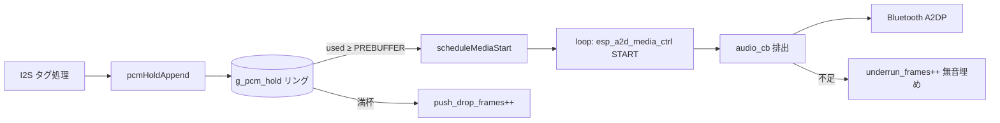

**適応 I2S バースト (`streamI2sBurstLimit`)**

PCM バッファ水位に応じて 1 回の `loop` で読む I2S チャンク数を 2–64 に制限し、過剰流入を防ぎます。

### 3.7 Bluetooth A2DP 出力

ESP32 は **A2DP Source**（送信側）として動作します。

```mermaid
sequenceDiagram
  participant BTN as ボタン/GAP
  participant FSM as BtState FSM
  participant I2S as I2S 入力
  participant PCM as PCM バッファ
  participant A2DP as audio_cb

  BTN->>FSM: 接続開始
  FSM->>FSM: ST_CONNECTING → ST_CONNECT
  Note over FSM: g_audio_enable=true<br/>resetAudioPipeline
  I2S->>PCM: タグ PCM 蓄積
  PCM->>FSM: used ≥ PREBUFFER
  FSM->>FSM: scheduleMediaStart (loop 待ち)
  Note over FSM: esp_a2d_media_ctrl START
  FSM->>A2DP: AUDIO_STATE_STARTED
  A2DP->>A2DP: beginPcmPlaybackToBt
  loop I2S→PCM→A2DP: 継続再生
```

**`BtState` 状態一覧**

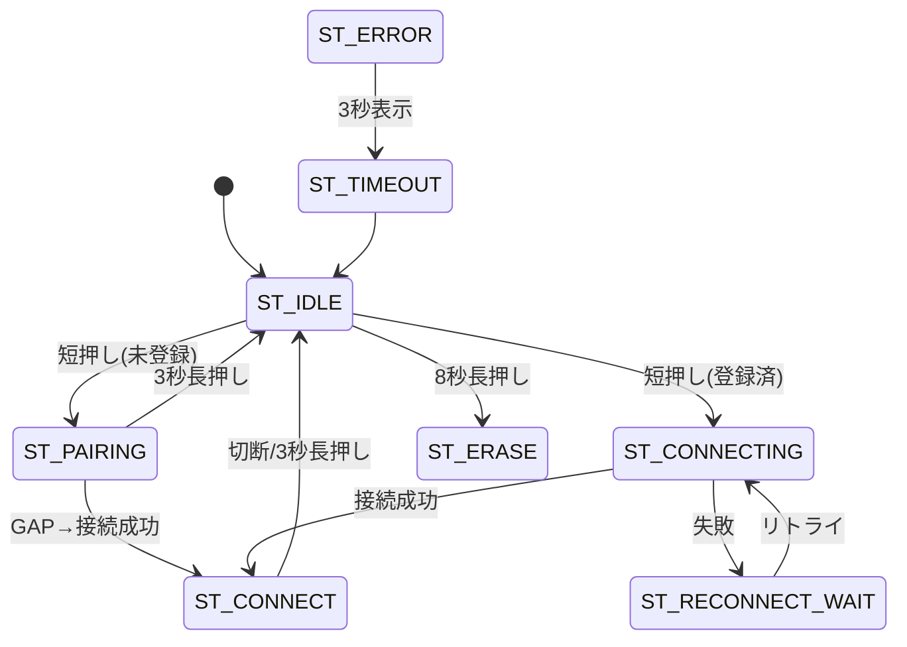

### 3.8 I2C Slave（オプション）

`UZU_ENABLE_I2C=1` 時:

- アドレス `0x30 + SEL[2:0]`（GPIO 17/18/19）
- Master から `SET_MODE` で WAV_PCM / MP3 モード同期
- BT 接続は GAP 発見後 `queueBtConnectPending` → Master の `NOTIFY_CONNECT_PERMISSION` 待ち

現行デフォルト (`UZU_ENABLE_I2C=0`): ボタン操作で直接 `a2dp.connect_to()`。

### 3.9 シリアル（Slave）

| 種別 | 内容 |
|------|------|
| 常時 | 起動バナー、`[PCM]` 5 秒ハートビート |
| ベンチモードのみ | `PIPE RST`, `BT GO`（`UZU_I2S_TEST_BYPASS_BT=1`） |

---

## 4. Master ↔ Slave 連携シーケンス

### 4.1 通常再生（SD → Slave → BT）

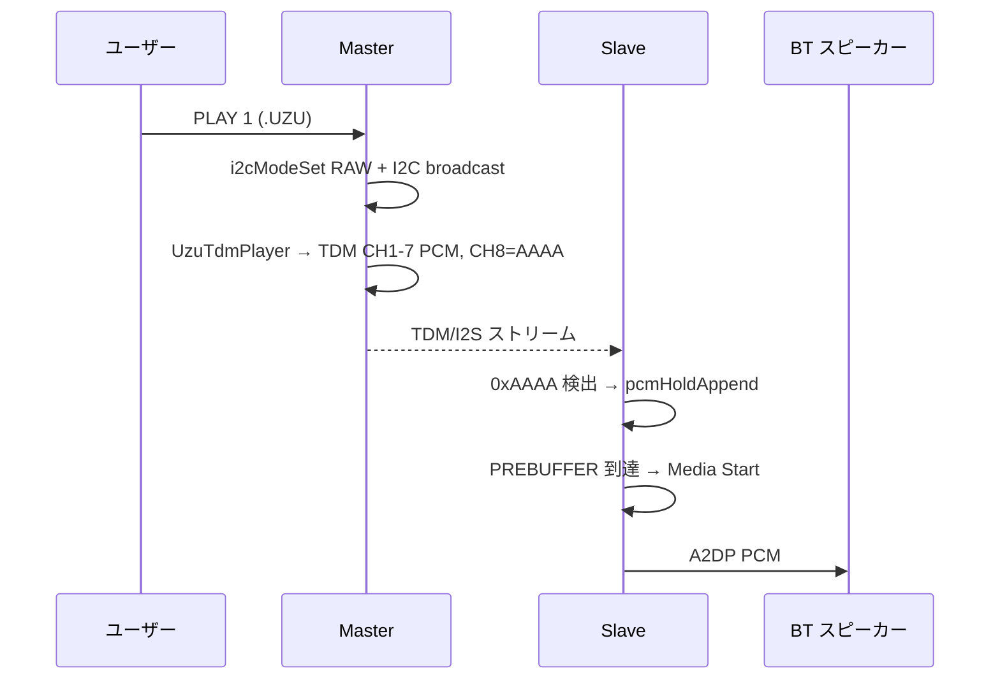

### 4.2 SINTEST（Slave 経路検証）

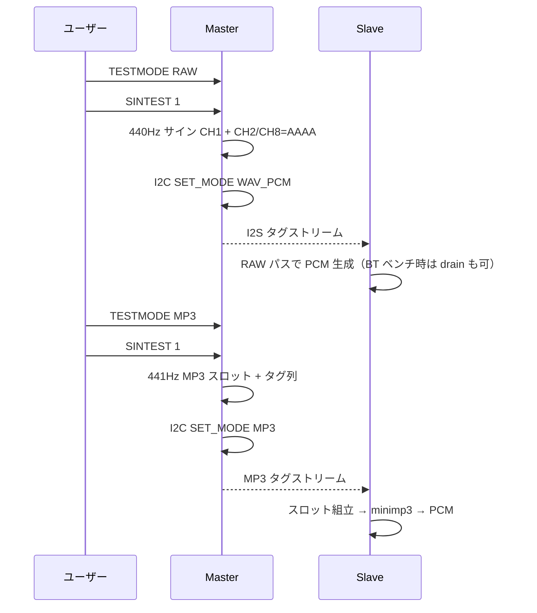

### 4.3 WiFi ストリーム（Master のみ、Slave 不使用）

ブラウザが Master AP (`192.168.4.1`) に接続し WebSocket で PCM を送信。Slave は関与しません（TDM 出力先は配線次第）。

---

## 5. スレッド構成一覧（両端末）

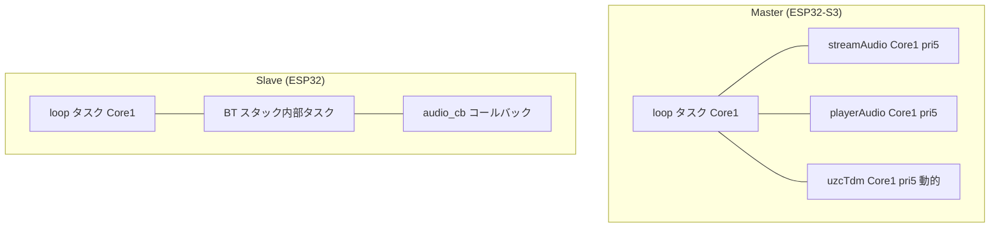

| 端末 | タスク / コンテキスト | 数 | 音声関連 |
|------|----------------------|-----|----------|
| Master | `loop` | 1 | I2STEST / SINTEST 出力 |
| Master | `streamAudio` | 1 | ストリーム TDM 出力 |
| Master | `playerAudio` | 1 | SD PCM TDM 出力 |
| Master | `uzcTdm` | 0–1（再生時のみ） | SD MP3 TDM 出力 |
| Slave | `loop` | 1 | I2S 入力・MP3 デコード・BT FSM |
| Slave | BT スタック + `audio_cb` | (IDF 内部) | A2DP 排出 |

---

## 6. ビルドフラグ（主要）

### Master (`uzuCastV3_Main/platformio.ini`)

| フラグ | デフォルト | 意味 |
|--------|-----------|------|
| `UZU_ENABLE_I2C` | 0 | I2C Host 機能 |
| `UZU_SKIP_POWER_BUTTON` | 1（開発時） | 起動時長押しスキップ |

### Slave (`uzuCastV3_Sub/platformio.ini`)

| フラグ | デフォルト | 意味 |
|--------|-----------|------|
| `UZU_ENABLE_I2C` | 0 | I2C Slave・Master 経由 BT 制御 |
| `UZU_I2S_TEST_BYPASS_BT` | 1 | BT 未接続でも I2S 処理継続 |

---

## 7. 改訂履歴

| 日付 | 内容 |
|------|------|
| 2026-07-16 | 初版作成（Master BUILD 10046 / Slave BUILD 96 時点） |
